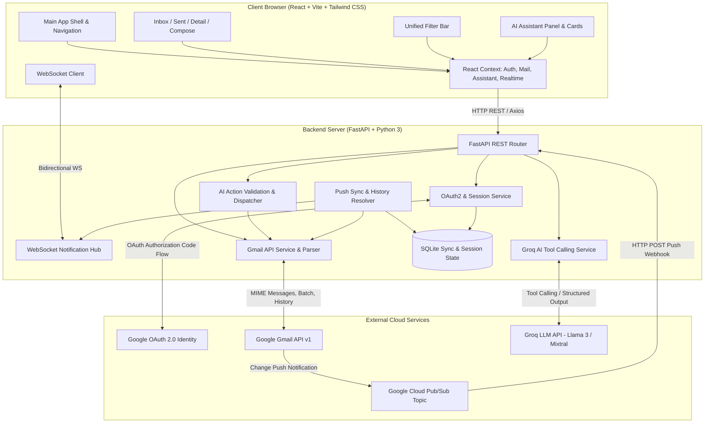
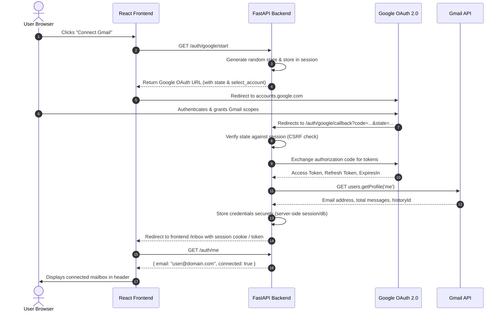
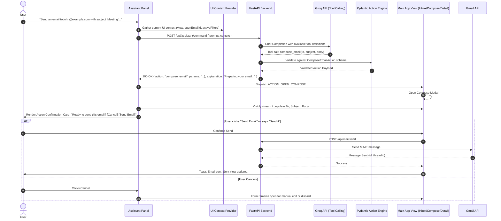
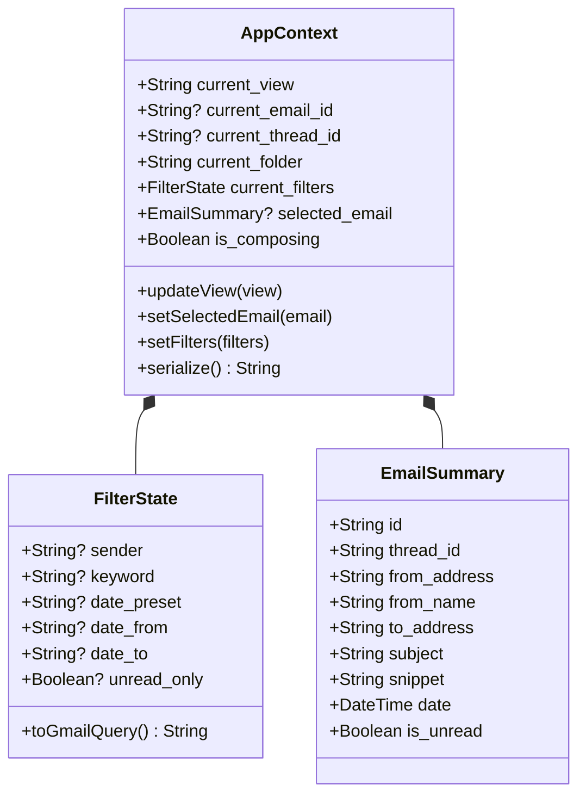
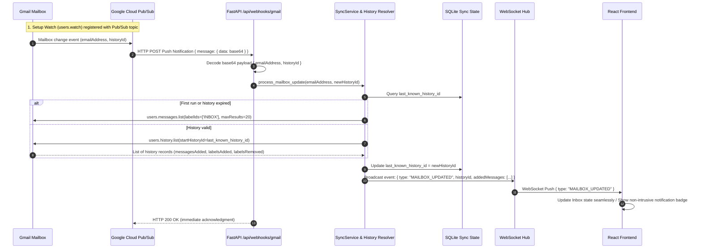

# NEBULA AI MAIL - SYSTEM ARCHITECTURE DOCUMENT

**Project**: Nebula AI Mail Web Application  
**Author**: Aditya-Ganesamoorthy <adityaganesamoorthy2912@gmail.com>  
**Version**: 1.0.0  
**Status**: Approved Architecture Specification  

---

## 1. High-Level Architecture Overview

Nebula AI Mail is designed as a secure, reactive email client with an embedded AI UI controller. Unlike traditional chatbot integrations that merely summarize text or provide conversational answers, Nebula AI Mail treats the AI assistant as a co-pilot that programmatically commands the frontend interface and orchestrates backend Gmail operations.



---

## 2. Directory & Component Architecture

### 2.1 Backend Project Structure (`backend/`)
```
backend/
├── app/
│   ├── main.py                  # FastAPI entry point, lifespan, CORS, middleware
│   ├── core/
│   │   ├── config.py            # Pydantic Settings (.env, defaults, secrets)
│   │   ├── security.py          # CSRF tokens, session encryption, state generation
│   │   └── logging.py           # Structured logging configuration
│   ├── routes/
│   │   ├── auth.py              # /auth/google/start, /auth/google/callback, /auth/logout, /auth/me
│   │   ├── mail.py              # /api/mail/inbox, /sent, /{id}, /search, /send, /reply, /mark-read
│   │   ├── assistant.py         # /api/assistant/command, /api/assistant/context
│   │   ├── realtime.py          # /api/webhooks/gmail (Pub/Sub), /ws/realtime (WebSocket)
│   │   └── health.py            # /health (liveness), /health/ready (readiness)
│   ├── services/
│   │   ├── gmail_service.py     # Google API client wrapper (messages, threads, watch)
│   │   ├── gmail_parser.py      # MIME extraction, HTML/text parser, attachment parser
│   │   ├── oauth_service.py     # OAuth2 credentials exchange, refresh token handling
│   │   ├── groq_service.py      # Groq client, prompt construction, function definitions
│   │   ├── action_service.py    # Strict Pydantic action validator and execution engine
│   │   ├── search_service.py    # Natural language to Gmail query syntax translator
│   │   └── sync_service.py      # Pub/Sub payload decoder, history.list sync, watch renewal
│   ├── schemas/
│   │   ├── auth.py              # Auth request/response models, user profile
│   │   ├── mail.py              # Message summary, message detail, send request, reply request
│   │   ├── assistant.py         # Chat request, UI context, assistant response
│   │   └── actions.py           # Action definitions (compose, search, filter, open, reply)
│   ├── models/
│   │   └── sync_state.py        # Minimal SQLite model for Gmail historyId & watch tracking
│   └── utils/
│       ├── email_utils.py       # RFC 5322 validation, MIME encoding, base64url helpers
│       └── date_utils.py        # Date range calculations, timezone offsets, relative times
├── tests/                       # Complete pytest suite
├── requirements.txt             # Pinned backend dependencies
├── .env.example                 # Backend environment variable template
└── pytest.ini                   # Pytest configuration
```

### 2.2 Frontend Project Structure (`frontend/`)
```
frontend/
├── src/
│   ├── components/
│   │   ├── layout/
│   │   │   ├── AppLayout.jsx    # Responsive grid shell (Sidebar + Main + Assistant)
│   │   │   ├── Header.jsx       # Global header, search, user avatar, account badge
│   │   │   └── Sidebar.jsx      # Navigation links (Inbox, Sent, Compose, Starred)
│   │   ├── mail/
│   │   │   ├── EmailList.jsx    # Virtualized/paginated email list
│   │   │   ├── EmailRow.jsx     # Individual message item (read status, snippet, date)
│   │   │   └── ThreadView.jsx   # Chronological message thread viewer
│   │   ├── compose/
│   │   │   ├── ComposeModal.jsx # Floating/embedded composer with visible autofill animation
│   │   │   └── SendConfirmationModal.jsx # Human-in-the-loop verification dialog
│   │   ├── filters/
│   │   │   ├── FilterBar.jsx    # Interactive filter controls (Presets, Sender, Dates, Read/Unread)
│   │   │   └── ActiveFilterChip.jsx # Removable tag for active filter parameters
│   │   ├── assistant/
│   │   │   ├── AssistantPanel.jsx # AI chat interface, command suggestions, status indicators
│   │   │   ├── ActionChip.jsx   # Visual badge indicating current AI action ("Filtering...", "Opening...")
│   │   │   ├── RichEmailCard.jsx # Interactive rich card in chat stream with "Open Email" action
│   │   │   └── ActionConfirmationCard.jsx # In-chat "Ready to send?" confirmation card
│   │   └── common/
│   │       ├── Skeleton.jsx     # Loading skeletons for list, detail, and cards
│   │       ├── EmptyState.jsx   # Professional enterprise empty states
│   │       ├── ErrorAlert.jsx   # User-friendly error banners
│   │       └── Toast.jsx        # Notification toasts (real-time sync alerts)
│   ├── pages/
│   │   ├── Inbox.jsx            # Inbox view with unified filters
│   │   ├── Sent.jsx             # Sent mail view
│   │   ├── EmailDetail.jsx      # Message reading view with HTML sanitize & reply trigger
│   │   └── Auth.jsx             # Login / Connect Gmail landing view
│   ├── context/
│   │   ├── AuthContext.jsx      # Current user profile, OAuth status, disconnect
│   │   ├── MailContext.jsx      # Messages, active folder, unified filter state, active thread
│   │   ├── AssistantContext.jsx # AI message history, pending actions, context provider
│   │   └── RealtimeContext.jsx  # WebSocket listener, reconnect handler, new mail alert
│   ├── hooks/
│   │   ├── useAuth.js
│   │   ├── useMail.js
│   │   ├── useAssistant.js
│   │   └── useRealtime.js
│   ├── services/
│   │   ├── api.js               # Axios instance with interceptors and base configuration
│   │   ├── auth.js              # Auth endpoints
│   │   ├── mail.js              # Mail endpoints
│   │   └── assistant.js         # Assistant endpoints
│   ├── utils/
│   │   ├── dates.js             # Date formatters (relative times, full timestamps)
│   │   ├── email.js             # Address parsing, snippet cleaners
│   │   └── sanitize.js          # DOMPurify HTML email content sanitizer
│   ├── index.css                # Tailwind directives and custom enterprise light styling
│   ├── App.jsx                  # React Router configuration & Context Provider hierarchy
│   └── main.jsx                 # Vite application mount
├── package.json
├── vite.config.js
└── tailwind.config.js           # Warm enterprise color tokens
```

---

## 3. Google OAuth 2.0 Flow Architecture

The application requires explicit server-side OAuth where the user can choose their dedicated Gmail account (via `prompt=select_account`).



---

## 4. AI Action System & UI Controller Flow

The AI Assistant is not a generic chatbot. It receives user natural language along with current UI context, generates structured tool calls via Groq, validates them via Pydantic on the backend, and dispatches structured actions that control the React UI.



### Supported Structured Actions

| Action Name | Input Parameters | UI Effect | Backend Operation |
| :--- | :--- | :--- | :--- |
| `compose_email` | `to`, `subject`, `body`, `cc` (opt), `bcc` (opt) | Opens compose view, visibly fills fields sequentially, presents send confirmation card | None (until confirmed send) |
| `send_email` | `to`, `subject`, `body`, `confirmed: bool` | Triggers send animation, updates Sent list | Sends MIME via Gmail API |
| `search_emails` | `sender`, `keyword`, `date_from`, `date_to`, `unread`, `read` | Sets active filter state, updates main Inbox list with query results | Translates to Gmail query string, executes `messages.list(q=...)` |
| `open_email` | `email_id` (or `search_criteria` e.g. "latest from David") | Navigates to `/email/:id`, loads message detail, updates current UI context | Fetches full message payload via Gmail API |
| `reply_email` | `email_id` (or inferred from context), `body` | Opens compose in reply mode, pre-fills recipient, sets `In-Reply-To` and `References` headers | Prepares reply draft with Gmail thread continuity |
| `filter_emails` | `unread`, `date_preset`, `sender`, `keyword` | Updates UI filter chips and filters inbox list | Queries Gmail API with filter query |
| `clear_filters` | None | Resets all active filters to default inbox state | Re-queries standard inbox (`labelIds=['INBOX']`) |
| `navigate` | `destination: "inbox" \| "sent" \| "compose"` | Transitions router to target page | None |

---

## 5. Context Management Architecture

To enable natural interactions such as **"Reply to this"** or **"Open the latest email from David"**, the application maintains a strict, observable UI Context that is synchronized on every user or AI action.



Whenever the user navigates, opens an email, or modifies filters, `AppContext` updates. When sending a command to `/api/assistant/command`, the serialized context is attached. This gives Groq the exact grounding needed to resolve relative references (e.g. "this email", "her", "the project email").

---

## 6. Real-Time Push Synchronization Architecture

To satisfy the requirement that **new emails must appear without a manual browser refresh** using real Gmail push notifications via Google Cloud Pub/Sub, the system implements the official Gmail Watch pattern:



### Watch Expiration & Renewal
- Gmail Watch registrations expire after at most 7 days.
- A lightweight background task / cron check in FastAPI inspects `watch_expiration` in SQLite and invokes `users.watch()` 24 hours prior to expiration to maintain unbroken real-time push.

---

## 7. Security Architecture

1. **Server-Side Secret Isolation**: `GOOGLE_CLIENT_SECRET`, `GROQ_API_KEY`, and OAuth tokens never reach the frontend. Frontend receives only short-lived session cookies or opaque JWT tokens.
2. **Untrusted HTML Sanitization**: Email bodies are sanitized using DOMPurify on the frontend and cleaned on the backend. Script tags, event handlers (`onerror`, `onclick`), object tags, and tracking scripts are stripped before rendering.
3. **Prompt Injection Defense**: Email content is strictly labeled as untrusted data (`<untrusted_email_content>`) within prompts. System instructions explicitly prohibit executing instructions originating from email text.
4. **Controlled AI Execution**: The AI model has no shell access, no arbitrary code execution capabilities, and no arbitrary URL access. It can only emit structured arguments strictly conforming to predefined Pydantic schemas.
5. **CORS & CSRF**: Strict CORS allows only the frontend origin. OAuth flows utilize an encrypted, timed state token to prevent CSRF exploits.

---

## 8. Database Architecture (Minimal SQLite)

In accordance with the specification, Gmail remains the single source of truth for email data. SQLite is used strictly for application-specific state:

```sql
CREATE TABLE IF NOT EXISTS sync_state (
    id INTEGER PRIMARY KEY AUTOINCREMENT,
    email_address TEXT UNIQUE NOT NULL,
    history_id TEXT NOT NULL,
    watch_expiration INTEGER NOT NULL,
    last_synced_at TIMESTAMP DEFAULT CURRENT_TIMESTAMP,
    created_at TIMESTAMP DEFAULT CURRENT_TIMESTAMP,
    updated_at TIMESTAMP DEFAULT CURRENT_TIMESTAMP
);

CREATE TABLE IF NOT EXISTS user_sessions (
    session_id TEXT PRIMARY KEY,
    email_address TEXT NOT NULL,
    access_token TEXT NOT NULL,
    refresh_token TEXT,
    token_expiry TIMESTAMP NOT NULL,
    created_at TIMESTAMP DEFAULT CURRENT_TIMESTAMP,
    updated_at TIMESTAMP DEFAULT CURRENT_TIMESTAMP
);
```

---

## 9. Design System: Enterprise Warm Palette

To deliver a premium, high-focus productivity interface without dark-mode gloom or stark sterile white, the design uses a curated warm enterprise palette:

- **Background Shell**: Warm off-white / canvas (`#FBFBF9` / `stone-50`)
- **Cards & Reading Surfaces**: Pure Ivory White (`#FFFFFF`) with subtle warm border (`#E7E5E4` / `stone-200`)
- **Primary Accent**: Muted Amber / Soft Gold (`#D97706` / `#B45309`)
- **Secondary Accent**: Warm Charcoal / Slate (`#334155` / `slate-700`)
- **Primary Text**: Deep Charcoal (`#1E293B` / `slate-800`)
- **Secondary / Meta Text**: Warm Gray (`#64748B` / `slate-500`)
- **Success / Status**: Sage Green (`#059669`)
- **Error / Warning**: Crimson Red (`#DC2626`)
- **Typography**: Inter / Outfit via Google Fonts with clear hierarchical weights (Regular 400, Medium 500, Semi-bold 600).
