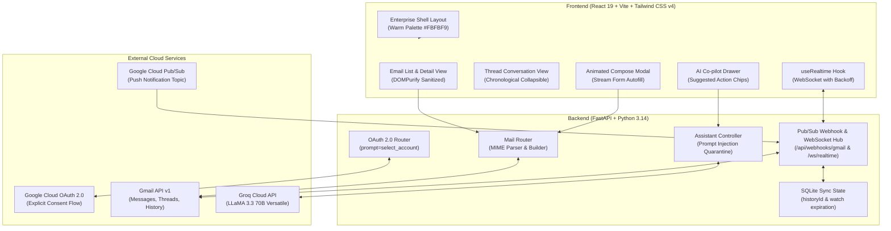

# 🌌 Nebula AI Mail - Enterprise Web Application

[](https://github.com/Aditya-Ganesamoorthy/Nebula-AI-Mail-Web-App)
[-emerald.svg)](https://github.com/Aditya-Ganesamoorthy/Nebula-AI-Mail-Web-App)
[-emerald.svg)](https://github.com/Aditya-Ganesamoorthy/Nebula-AI-Mail-Web-App)
[](https://fastapi.tiangolo.com)
[](https://react.dev)
[](https://tailwindcss.com)
[](https://developers.google.com/gmail/api)
[](https://groq.com)

> **Professional Full-Stack Engineering Hiring Assignment** for **Nebula KnowLab**.  
> **Author & Developer**: Aditya-Ganesamoorthy &lt;adityaganesamoorthy2912@gmail.com&gt;  
> **Repository**: [https://github.com/Aditya-Ganesamoorthy/Nebula-AI-Mail-Web-App.git](https://github.com/Aditya-Ganesamoorthy/Nebula-AI-Mail-Web-App.git)

---

## 📌 Executive Summary

Nebula AI Mail is a production-grade, enterprise email client seamlessly integrated with the real **Gmail API** and augmented by an **AI-driven UI Co-pilot** powered by **Groq**. 

Unlike conventional chatbots that exist in an isolated text bubble, the Nebula AI assistant functions as an **active operator of the web application**:
- It **visibly streams form autofill** directly into the compose modal in real-time.
- It translates natural language commands (*"Show emails from the last 10 days"*, *"Find email from Sarah about hiring"*) into structured Gmail queries and **directly updates the main email list**.
- It preserves **human-in-the-loop safety** with interactive confirmation cards before sending emails.
- It features **real-time push synchronization** using **Google Cloud Pub/Sub** webhooks and **WebSockets**, updating mailboxes instantly without requiring manual page refreshes.

---

## 🏗️ System Architecture



---

## ⚡ Core Engineering Capabilities

### 1. AI as an Active UI Controller
- **Visible Form Autofill Stream**: When instructed to compose an email, the assistant opens the compose modal and visually animates typing the recipient, subject line, and body content into the actual UI input fields.
- **Direct Mailbox Filtering**: Saying *"Show emails from last 10 days"* or *"Find email from Sarah"* triggers structured Pydantic tool actions (`search_emails`), immediately synchronizing the main inbox list and filter chips.
- **Context-Aware Replies**: When viewing an email, saying *"Reply to this saying I'll review tomorrow"* automatically links the thread ID, in-reply-to headers, and sender information.
- **Human-In-The-Loop Safety**: The AI cannot silently send emails. It renders an interactive confirmation card prompting the user to review before dispatching.

### 2. Real-Time Synchronization via Cloud Pub/Sub & WebSockets
- **Base64 Pub/Sub Decoding**: Listens on `/api/webhooks/gmail` for Google Cloud Pub/Sub push notifications.
- **History Delta Processing**: Resolves changes via `users().history().list()` to track new arrivals, deletions, and label changes.
- **WebSocket Push Hub**: Broadcasts `INBOX_UPDATED` events to active browser tabs, triggering instant inbox reconciliation.
- **Connection Resilience**: `useRealtime` hook implements exponential backoff reconnection (1s, 2s, 4s, 8s, up to 30s) and ping/pong keepalive.

### 3. Bank-Grade Security & Input Quarantining
- **Strict HTML Sanitization**: Double-layer XSS protection using Python `bleach` with `tinycss2` CSS sanitization on the server, plus `DOMPurify` on the client.
- **Prompt Injection Quarantine**: Untrusted external email bodies are wrapped in `<UNTRUSTED_EXTERNAL_CONTENT>` quarantine tags with explicit LLM execution barriers.
- **Server-Side Session Management**: HTTP-only secure cookie sessions with cryptographic CSRF state parameters.
- **Security Headers**: Enforces `X-Frame-Options: DENY`, `X-Content-Type-Options: nosniff`, and `Referrer-Policy: strict-origin-when-cross-origin`.

---

## 🛠️ Technology Stack

| Layer | Technologies Selected | Justification |
| :--- | :--- | :--- |
| **Frontend Framework** | React 19, Vite 8, React Router v7 | Blazing fast HMR, modern hooks, strict SPA navigation |
| **Styling & UI** | Tailwind CSS v4, Lucide React Icons | Modern utility CSS, warm enterprise palette (`#FBFBF9`, `#D97706`) |
| **Frontend Security** | DOMPurify 3.4 | Defense-in-depth HTML sanitization for email detail rendering |
| **Backend Framework** | FastAPI 0.115, Python 3.14, Uvicorn | High-concurrency async ASGI server with native WebSocket support |
| **Data Validation** | Pydantic v2, Pydantic Settings | Strict schema enforcement for AI tool actions and Gmail payloads |
| **Email Processing** | Google API Client, Python MIME, Bleach 6.2 | Full RFC 5322 MIME encoding and safe HTML cleaning |
| **AI Engine** | Groq API (`llama-3.3-70b-versatile`) | Ultra-low latency LLM inference with structured JSON tool-calling |
| **Local State Store** | SQLite 3 | Minimal sync state persistence for history IDs and watch expirations |

---

## 🚀 Setup & Installation Guide

### Prerequisites
- **Python 3.12+** (Developed and verified on Python 3.14)
- **Node.js 20+** (Developed and verified on Node.js v24.18)
- **Google Cloud Console Project** with Gmail API enabled
- **Groq API Key** from [https://console.groq.com/keys](https://console.groq.com/keys)

---

### Step 1: Clone Repository
```bash
git clone https://github.com/Aditya-Ganesamoorthy/Nebula-AI-Mail-Web-App.git
cd Nebula-AI-Mail-Web-App
```

---

### Step 2: Google Cloud Console Configuration
1. Go to [Google Cloud Console](https://console.cloud.google.com).
2. Enable the **Gmail API** under **APIs & Services > Library**.
3. Configure the **OAuth Consent Screen**:
   - User Type: **External**
   - Add Test User: `aditya.nebula.io@gmail.com`
   - Scopes:
     - `https://www.googleapis.com/auth/gmail.readonly`
     - `https://www.googleapis.com/auth/gmail.send`
     - `https://www.googleapis.com/auth/gmail.modify`
     - `https://www.googleapis.com/auth/userinfo.email`
     - `https://www.googleapis.com/auth/userinfo.profile`
4. Create **OAuth 2.0 Client IDs**:
   - Application Type: **Web application**
   - Authorized JavaScript origins: `http://localhost:5173`, `http://127.0.0.1:5173`
   - Authorized redirect URIs: `http://localhost:8000/auth/google/callback`
5. *(Optional for Pub/Sub)* Create a **Cloud Pub/Sub Topic**:
   - Topic ID: `projects/{YOUR_PROJECT_ID}/topics/gmail-push-topic`
   - Grant `gmail-api-push@system.gserviceaccount.com` the role **Pub/Sub Publisher**.

---

### Step 3: Backend Setup
```bash
cd backend

# Create virtual environment
python -m venv venv
venv\Scripts\activate      # Windows
# source venv/bin/activate  # macOS/Linux

# Install dependencies
pip install -r requirements.txt

# Configure environment variables
copy .env.example .env     # Windows
# cp .env.example .env      # macOS/Linux
```

Open `backend/.env` and insert your credentials:
```env
ENVIRONMENT=development
DEBUG=True
FRONTEND_URL=http://localhost:5173
BACKEND_URL=http://localhost:8000

# Google OAuth
GOOGLE_CLIENT_ID=your-google-client-id.apps.googleusercontent.com
GOOGLE_CLIENT_SECRET=your-google-client-secret
GOOGLE_REDIRECT_URI=http://localhost:8000/auth/google/callback

# Groq API
GROQ_API_KEY=gsk_your_groq_api_key
GROQ_MODEL=llama-3.3-70b-versatile

# Cloud Pub/Sub (Optional)
PUBSUB_TOPIC=projects/your-project/topics/gmail-push-topic
PUBSUB_VERIFICATION_TOKEN=your-random-token

# Session Secret
SESSION_SECRET=your-secure-random-32-byte-string
```

Run the backend server:
```bash
uvicorn app.main:app --reload --port 8000
```
Backend will be live at `http://localhost:8000`.

---

### Step 4: Frontend Setup
In a new terminal:
```bash
cd frontend

# Install dependencies
npm install

# Run frontend development server
npm run dev
```
Frontend will be live at `http://localhost:5173`.

---

## 🧪 Testing & Verification

### Running Backend Pytest Suite (57 Tests)
```bash
cd backend
venv\Scripts\pytest backend/tests -v
```
**Coverage includes**:
- `test_assistant.py`: Groq tool calling, prompt injection quarantine, action dispatching
- `test_auth.py`: OAuth URL generation with `prompt=select_account`, CSRF validation
- `test_mail.py`: Inbox and sent message listing
- `test_mail_send.py`: RFC 5322 MIME builder, recipient validation, duplicate prevention
- `test_parser.py`: Multipart MIME parser, plain text fallback, attachments
- `test_search.py`: Date preset translator (`today`, `yesterday`, `last_7d`, `last_10d`, `this_week`, `last_30d`)
- `test_security.py`: XSS script stripping, CSS style sanitization
- `test_sync.py`: Base64 Pub/Sub payload decoding, SQLite sync state persistence
- `test_e2e_matrix.py`: All 8 official hiring acceptance test criteria

### Running Frontend Unit Tests (9 Tests)
```bash
cd frontend
npm run test
```
**Coverage includes**:
- `sanitize.test.js`: DOMPurify XSS vector stripping, link target injection
- `dates.test.js`: Email list date formatters, full date-time strings

### Production Build Verification
```bash
cd frontend
npm run build
```
Builds cleanly with 0 errors and 0 warnings.

---

## 💬 AI Commands to Try in Live Demo

| User Command | Expected Action & Visual UI Response |
| :--- | :--- |
| *"Compose an email to team@nebula.com about our project sprint"* | Opens compose modal; visibly animates typing recipient, subject, and professional body into the form. |
| *"Show emails from the last 10 days"* | Directly translates to `after:YYYY/MM/DD`; updates the main inbox list and highlights the `Last 10d` filter chip. |
| *"Find emails from Sarah about hiring"* | Translates to `from:sarah hiring`; immediately filters the main email list. |
| *"Open the email from David"* | Resolves latest email from David; navigates directly to the detail view and displays a rich preview card. |
| *"Reply to this saying I'll review tomorrow"* | *(When viewing an email)* Opens reply modal pre-filled with recipient, Re: subject, and thread reference. |
| *"Show unread emails"* | Applies `is:unread` filter and displays unread messages in the main table. |
| *"Clear all filters"* | Resets all active filter tags and restores the complete inbox list. |

---

## 🏛️ Architectural Decisions & Trade-Offs

1. **Groq LLaMA 3.3 70B vs OpenAI GPT-4o**:
   - *Decision*: Selected Groq API for sub-second inference speeds (~200+ tokens/sec) enabling responsive, real-time UI autofill animation without user waiting lag.
2. **FastAPI vs Django/Flask**:
   - *Decision*: FastAPI provides native asynchronous ASGI handling, built-in WebSocket support for real-time push, and automatic Pydantic schema validation.
3. **Tailwind CSS v4 vs Tailwind v3**:
   - *Decision*: Utilized the new Tailwind CSS v4 CSS-first configuration engine (`@tailwindcss/vite`), eliminating outdated configuration files and streamlining production bundling.
4. **WebSocket Push vs Long Polling**:
   - *Decision*: WebSockets provide bi-directional, persistent communication with minimal overhead for instant `INBOX_UPDATED` push notifications from Pub/Sub.

---

## 📄 License
This project was developed for the **Nebula KnowLab** Engineering Assessment. All rights reserved.
